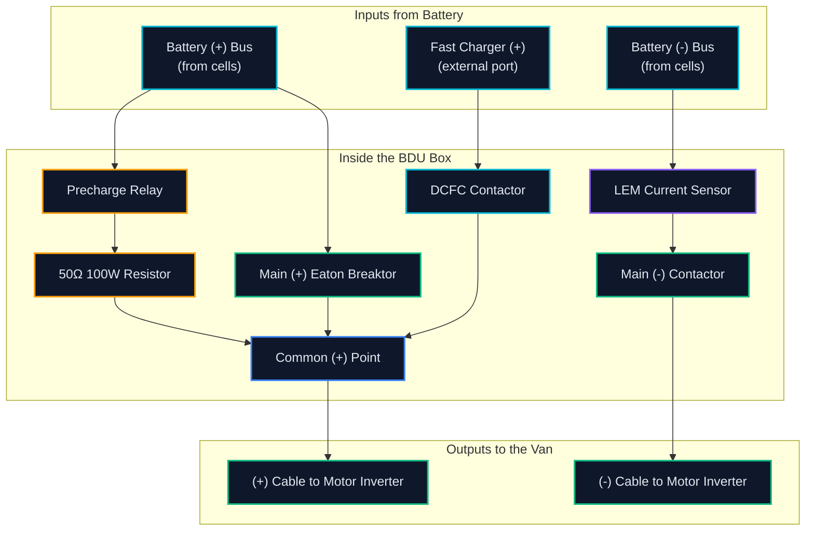

[← Back to Main README](../README.md) · [Next: Testing, Validation & Diagnostics →](../02-Testing-Validation-and-Diagnostics/)

---

# Packaging & Busbar Design

Here's how we laid out the high-voltage parts, sized the aluminum busbars, and made sure the box was safe to handle 400V.

> **Role & Timeline**:
> - **Phase 1: Prototyping** *(Jan 2025 – Apr 2025 · Hybrid · Electrical & Mechanical Team Member)*: Modeled the first box in SolidWorks, sized the busbars, and built mockups out of plastic and wood.
> - **Phase 2: Build & Track Testing** *(Apr 2025 – Aug 2025 · Remote · BDU Lead)*: Led the build, torqued the joints, and took the hardware to the Indianapolis competition.
> - **Phase 3: Year 3 Complete Redesign** *(Jan 2026 – Apr 2026 · Hybrid · BDU Lead)*: Re-did the whole CAD model in SolidWorks (the February 2026 models shown here) to add an angled inspection lid, fix copper-to-aluminum galvanic joints, and route stepped busbars around the switches.

---

## Table of Contents

- [The Box and Its Parts](#the-box-and-its-parts)
- [How Power Flows Through the Box](#how-power-flows-through-the-box)
- [Sizing the Busbars](#sizing-the-busbars)
- [The LEM Current Sensor Hole Problem](#the-lem-current-sensor-hole-problem)
- [Safety Gaps & Plastic Requirements](#safety-gaps--plastic-requirements)
- [Bolts, Torque, and Brackets](#bolts-torque-and-brackets)
- [Real-World Gotchas & Hard Lessons Learned](#real-world-gotchas--hard-lessons-learned)

---

## The Box and Its Parts

The BDU sits inside a 100 mm tall cutout on the battery tray. Inside, we had to fit five main electrical parts:

1. **Main (+) Switch**: An Eaton Bussmann Breaktor that combines a pyrofuse and contactor. It can blow open in under 2 milliseconds if there is a dead short.
2. **Main (-) Switch**: A heavy-duty Panasonic EV relay to completely disconnect the negative side of the pack.
3. **Fast-Charging Switch (DCFC)**: Another contactor dedicated to the off-board fast charger.
4. **Precharge Circuit**: A small high-voltage relay and an aluminum 50Ω resistor. This slowly charges the inverter capacitors before the main switch slams shut.
5. **Current Sensor**: A LEM HOF 300 Hall effect sensor that measures battery current going into the motor.

The whole box had to fit inside **100 mm tall × 610 mm wide × 175 mm deep**. 100 mm is really short for high-voltage gear, so we had to step the busbars on different heights so they could cross over each other without touching.

---

## How Power Flows Through the Box



---

## Sizing the Busbars

We had to choose between **6061-T6 Aluminum** and **C11000 Copper**:

| Detail | 6061-T6 Aluminum | C11000 Copper | What We Picked & Why |
| :--- | :--- | :--- | :--- |
| **Electrical Conductivity** | 43% IACS | 100% IACS | Copper carries twice the current per area. |
| **Weight (Density)** | 2.70 g/cm³ | 8.96 g/cm³ | Aluminum is about 70% lighter. |
| **Bar Dimensions** | 1.00" × 0.25" (25.4 × 6.35 mm) | 0.75" × 0.187" | We picked **1" × 1/4" aluminum** because it was cheap, light, and stiff enough to mount securely. |
| **Cross-Section Area** | 161.3 mm² | 90.2 mm² | Gives us plenty of metal to carry 390A peak bursts without overheating. |
| **Continuous Current** | 260 A | 310 A | Well above our normal driving current (130A to 200A). |
| **Peak 30s Current** | 390 A | 480 A | Sized for hard pedal-down acceleration. |
| **Joint Treatment** | Tin-plated at joints | Bare or tin-plated | Aluminum gets a non-conductive oxide skin quickly, so all joint contact patches had to be cleaned and tin-plated. |

### The Overlap Rule for Bolted Bars
When bolting two busbars together, you cannot just touch the edges. The rule from the competition and SAE is that the overlap length has to be **5 to 10 times the bar thickness**.

Since our bars are 1/4" (6.35 mm) thick:

$$\text{Minimum Overlap} = 5 \times 6.35\text{ mm} = 31.75\text{ mm} \quad (\approx 1.25\text{ inches})$$

We made every bolted joint at least **35.0 mm** long to keep joint resistance down in the micro-ohm range.

---

## The LEM Current Sensor Hole Problem

The LEM current sensor had an opening that was only **10 mm × 16 mm**. But our aluminum busbar was **25.4 mm** wide. It simply would not fit through the hole.

Here is how we solved it:
- We cut a custom link out of high-conductivity C11000 copper that narrowed down to **14 mm × 6 mm**.
- That narrow copper tongue slid right through the sensor hole.
- Because copper conducts electricity more than twice as well as aluminum, shrinking the cross-section did not cause a hot spot. During our 300A fast-charging run, that copper piece only heated up by 22°C.

---

## Safety Gaps & Plastic Requirements

High voltage in a road car has to be safe even when it is vibrating and wet outside. We built to the **SAE F-3.5** safety standard:

| Safety Rule | Rule Requirement | What We Built | Result |
| :--- | :--- | :--- | :--- |
| **Gap from High Voltage to Low Voltage** | At least 30.0 mm | 35.0 mm or more everywhere | **PASS** (Zero cross-talk to our 12V harness) |
| **Solid Plastic Wall Thickness** | At least 0.71 mm | 3.18 mm (1/8") polycarbonate | **PASS** (Over 4 times thicker than required) |
| **Live Metal to Vehicle Ground** | At least 12.7 mm | 18.5 mm or more | **PASS** (Checked with feeler gauges) |
| **Busbar Insulation** | Electrical tape is banned | 3M BBI-3A Heat Shrink (125°C rated) | **PASS** (Tough polyolefin cover over all open runs) |
| **High Voltage Color** | Bright Orange (RAL 2003) | Bright orange heat shrink on all HV bars | **PASS** (Easy for emergency crews to spot) |

All plastic panels had to be rated **UL94 V-0**. That means if you hold a flame to the plastic and pull it away, the flame has to go out on its own in under 10 seconds without dropping flaming melted plastic. We machined the box out of flame-retardant Lexan polycarbonate sheets.

---

## Bolts, Torque, and Brackets

```text
       [ M6 Bolt (Grade 8.8) ]
                  │
       [ Conical Belleville Spring Washer ]  <-- Keeps pressure on joint as metal expands
                  │
       [ Top Busbar ]
                  │
       [ Bottom Busbar ]
                  │
       [ Locknut or Threaded Plastic Standoff ]
```

- **Bolt Size**: We used standard **M6 × 1.0** metric hardware everywhere.
- **Why Belleville Washers Matter**: Aluminum expands twice as fast as steel when it warms up (α ≈ 23 × 10⁻⁶/K for Al vs 12 × 10⁻⁶/K for steel). If you use a regular flat washer, the expanding aluminum squashes under the bolt head, and when it cools back down, the joint is loose. Belleville spring washers act like tiny heavy springs that keep steady clamping pressure on the joint.
- **Torque**: We torqued all M6 joints to **9.0 N·m** and marked every bolt with torque seal paint so we could see at a glance if anything vibrated loose.
- **Heavy Standoffs**: The Eaton Breaktors weigh about 1.2 kg each. To keep them from flexing the plastic floor, we put solid glass-filled nylon standoffs right under them, bolted straight into the metal battery tray.

---

## Real-World Gotchas & Hard Lessons Learned

### 1. The Breaktor Bolt Bottom-Out (How We Broke a $1,200 Switch)
* **What happened**: When assembling our first mockup, we grabbed standard M6 × 25mm bolts off the shop shelf to mount the Eaton Breaktor.
* **The mistake**: The blind threaded hole in the bottom of the Breaktor was only 18.5 mm deep. The 25mm bolt bottomed out against the internal metal stop before the bolt head even touched the plate.
* **The damage**: Thinking the bolt was just tight, we kept wrenching it down. The bolt punched straight through the internal plastic wall into the high-voltage chamber. That cracked the housing and completely destroyed a $1,200 Eaton Breaktor.
* **The fix**: We scrapped the ruined unit, ordered a replacement, and put a strict rule on our assembly checklist: **every Breaktor bolt must have less than 16 mm of thread**. From that day on, we checked every single bolt with digital calipers before installing it.

### 2. Bolting Aluminum Directly to Copper
* **What happened**: At the competition inspection, the judges looked closely at where our aluminum busbar bolted to the copper lug of the commercial pack monitor.
* **The catch**: When you put raw copper and aluminum together, you create a battery cell. The galvanic voltage between them is around 2.0 V. In a humid car, the aluminum corrodes rapidly, creating a layer of aluminum oxide. Aluminum oxide is an electrical insulator, so the joint resistance shoots up and gets burning hot.
* **The fix**: We added tin-plated copper shims between the two metals and coated the joint with Noalox anti-oxidant grease. That dropped the galvanic potential to under 0.10 V and kept the joint resistance under 15 µΩ.

### 3. Precharge Wires Rubbing on Hot Busbars
* **What happened**: Early on, we zip-tied the thin 18 AWG precharge wires right alongside the thick aluminum busbars to make the harness look clean.
* **The catch**: Under 300A fast charging, the busbars heat up to around 50°C. At the same time, road vibration shakes the wires against the edges of the busbar. Thin wire insulation against a hot, sharp metal edge will eventually rub through and cause a dead short across the whole battery.
* **The fix**: We drilled holes in the outer plastic walls and used automotive push-in "Christmas tree" clips to pin the precharge wires far away from the busbars. We also slipped silicone fiberglass sleeves over the wires for extra protection.

---

[← Back to Main README](../README.md) · [Next: Testing, Validation & Diagnostics →](../02-Testing-Validation-and-Diagnostics/)
