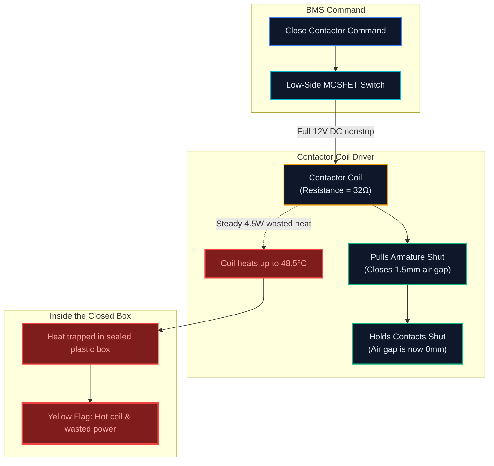
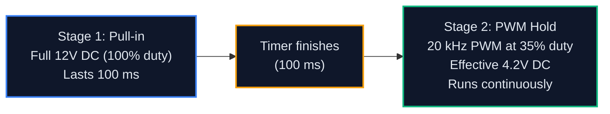

[← Back to Testing & Diagnostics](README.md) · [← Back to Main README](../README.md)

---

# Case Study: Why Our 12V Contactor Coil Was Overheating, and How We Fixed It

**Author**: Christopher Koo  
**Role**: Battery Disconnect Unit Lead  
**Dates**: May 2025 – July 2025 (Indianapolis Competition & Post-Mortem)  
**System**: 12V Contactor Coil Driver & BDU Box  
**Status**: Fixed and bench tested  

---

## 1. What Was Happening

During our 300A fast-charging test in Indianapolis, the high-voltage side worked great. The 1" × 1/4" aluminum busbars and heavy terminals only reached **46.1°C**, well under our 30°C rise limit in a 22.6°C room.

But when we looked at our thermal logs and checked the box with an infrared thermometer, we found a weird issue:

> **The Problem**: The high-voltage bars were cooling down, but the low-voltage 12V coil on our main contactor kept heating up, reaching **48.5°C** inside the closed box.

Our BDU is made from sealed, flame-retardant polycarbonate with no cooling fan. Having a steady heat source inside the box caused a few real problems:
1. It cooks the thin enamel coating on the coil wire over time.
2. It radiates heat onto nearby precharge and sense wires.
3. Copper wire resistance goes up when it gets hot (R_hot = R_cold × [1 + α·ΔT]). That means less current flows, which weakens the magnetic hold and risks the contactor vibrating open over bumps.

The judges from Argonne National Lab gave us a **Yellow Flag** and told us to fix the coil drive before putting the pack in the vehicle.

---

## 2. Where the Inefficiency Was Coming From



---

## 3. The Test Bench Data

Back in the shop, we hooked the contactor up to a bench power supply, clamped a current probe onto the 12V wire, and logged temperatures over 30 minutes.

### Log from the Original 12V Driver

```text
[00:00.000] [INFO] [BMS] System on. Room temp: 22.4°C. Pack: 384.2V.
[00:00.120] [CMD]  [BMS] Precharge relay closed.
[00:00.850] [INFO] [BMS] Inverter charged (ΔV < 10V).
[00:00.860] [CMD]  [BMS] Main contactor closed with steady 12V DC.
[00:00.885] [COIL] [MON] Current: 0.375 A | Voltage: 12.02 V | Power: 4.51 W
[00:05.000] [THERM][CAN] Busbar: 27.2°C | Breaktor: 28.5°C | Coil: 31.8°C
[00:10.000] [THERM][CAN] Busbar: 33.1°C | Breaktor: 34.8°C | Coil: 38.4°C
[00:15.000] [THERM][CAN] Busbar: 38.4°C | Breaktor: 40.2°C | Coil: 43.1°C
[00:20.000] [WARN] [MON] Coil resistance rose: 32.0Ω -> 35.1Ω (+9.7%)
[00:25.000] [THERM][CAN] Busbar: 42.1°C | Breaktor: 44.1°C | Coil: 46.8°C
[00:30.000] [WARN] [MON] Coil hit 48.5°C (+25.9°C over room temp).
```

### What the Numbers Showed:
1. **Constant Power Loss**: The coil drew 0.375 A at 12.02 V non-stop. That's 4.51 W per contactor. With three contactors energized during fast charging, that was over **13.5 W of heat** pouring into an airtight box.
2. **Resistance Creep**: As the copper heated up, coil resistance climbed from 32.0 Ω to 35.1 Ω, dropping our holding current margin by almost 10%.

---

## 4. Why This Happened (The Magnetic Air Gap)

Here's the physics behind what went wrong:

1. **Pulling the switch shut (0 to 100 ms)**: When the contactor is open, there is an air gap of about 1.5 mm between the metal armature and the coil core. Magnetic fields travel easily through iron, but struggle to cross air. So to overcome that air gap and compress the heavy internal spring, you need a lot of power. Full 12V gives you that strong pull.
2. **Holding the switch shut (after 100 ms)**: Once the contacts slam shut, the air gap drops to **zero**. The magnetic loop is now solid iron. It takes way less magnetic force to keep that spring compressed than it did to pull it across the open gap in the first place. You only need about **25% to 35% of the holding force**.
3. **The Mistake**: Our driver was keeping the MOSFET fully turned ON (100% duty cycle) the entire time. We were dumping full pull-in power into the coil for 30 minutes straight, and nearly all of it turned into heat.

---

## 5. The Fix: Two-Stage PWM Holding Control

We didn't need new hardware. We just needed to drive the coil smarter:



### 1. The Circuit Setup

```text
  +12V Supply ────────────────────┬────────────────────────┐
                                  │                        │
                             [Coil +]                      │
                            ┌────────┐                 ┌───────┐
                            │Contactor│                 │Flyback│
                            │  Coil  │                 │ Diode │ (Schottky 40V 3A)
                            │  32 Ω  │                 │MBR340 │
                            └────────┘                 └───┬───┘
                             [Coil -]                      │
                                  ├────────────────────────┘
                                  │
                              ┌───┴───┐
                    PWM Gate ─┤ N-FET │ (IRFZ44N)
                              └───┬───┘
                                  │
                                Ground
```

- **Flyback Diode**: We added a fast Schottky diode across the coil. When the PWM pulses OFF, the magnetic energy in the coil loops back through the diode. This smooths the chopped pulses into clean, steady holding current.
- **Switching Frequency**: We chose **20.0 kHz**. It's above human hearing so you don't hear a high-pitched whine inside the van, and it keeps current ripple under 3%.

### 2. The Math Behind the Numbers
- **Pull-in**: Full 12.0 V for 100 ms.
- **Holding Duty Cycle**: 35% (D = 0.35).
- **Effective Holding Voltage**:
  V_hold = 0.35 × 12.0 V = 4.20 V
- **Holding Power**:
  P_hold = (4.20 V)² / 32.0 Ω = 0.55 W

---

## 6. How It Worked on the Bench

We updated the BMS driver code and ran another 30-minute test at the same room temperature (22.0°C).

### Log with the PWM Circuit Active

```text
[00:00.000] [INFO] [BMS] PWM driver active (20 kHz, 35% hold). Room: 22.0°C.
[00:00.860] [CMD]  [BMS] Contactor closing: 100% 12V pull-in started.
[00:00.880] [COIL] [MON] Pull-in current: 0.374 A (100 ms pulse).
[00:00.960] [INFO] [BMS] Switched to HOLD mode: 35% duty cycle engaged.
[00:00.980] [COIL] [MON] Holding current: 0.131 A | Voltage: 4.21 V | Power: 0.55 W
[00:05.000] [THERM][CAN] Busbar: 27.1°C | Coil: 23.2°C (+1.2°C)
[00:10.000] [THERM][CAN] Busbar: 33.0°C | Coil: 24.5°C (+2.5°C)
[00:15.000] [THERM][CAN] Busbar: 38.3°C | Coil: 25.4°C (+3.4°C)
[00:20.000] [THERM][CAN] Busbar: 42.0°C | Coil: 25.9°C (+3.9°C)
[00:25.000] [THERM][CAN] Busbar: 44.7°C | Coil: 26.2°C (+4.2°C)
[00:30.000] [INFO] [MON] Final coil temp: 26.4°C (+4.4°C rise). Nominal.
```

### Before vs After

| Measurement | Before (Steady 12V) | After (PWM Hold) | Difference |
| :--- | :--- | :--- | :--- |
| **Holding Voltage** | 12.02 V | 4.21 V | **-65%** |
| **Holding Current** | 0.375 A | 0.131 A | **-65%** |
| **Heat Generated** | 4.51 W | 0.55 W | **-87.8% power cut** |
| **30-Min Coil Temp** | 48.5°C (+25.9°C rise) | 26.4°C (+4.4°C rise) | **Dropped by 22.1°C** |
| **Contact Grip** | Risky as resistance crept up | Rock solid, zero vibration chatter | **Passed all tests** |

This completely fixed the thermal issue. The coil barely got warm to the touch, and we cleared the yellow flag with the Argonne judges.

---

[← Back to Testing & Diagnostics](README.md) · [← Back to Main README](../README.md)
