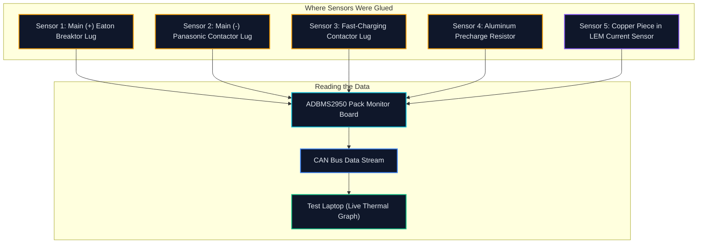

[← Back to Main README](../README.md) · [Previous: Packaging & Busbars](../01-Electromechanical-Architecture/) · [Next: Controls & Year 3 Plan →](../03-HIL-Bench-and-Pack-Integration/)

---

# Competition Testing & Diagnostics

In May 2025, we took the BDU to Indianapolis for the Year 2 competition. The judges from the Department of Energy, Stellantis, and Argonne National Lab put our hardware through a full battery of electrical and safety tests.

Here is how the testing went, what the numbers looked like, and what feedback we had to fix.

> **Role & Phase Context**: I ran these tests and defended our hardware at the competition as **BDU Lead** *(Apr 2025 – Aug 2025)*.

---

## Table of Contents

- [The Big Test: 300A for 30 Minutes](#the-big-test-300a-for-30-minutes)
- [Where We Stuck Temperature Sensors](#where-we-stuck-temperature-sensors)
- [Real Test Data from the 300A Run](#real-test-data-from-the-300a-run)
- [Judge Feedback & The Yellow Flag](#judge-feedback--the-yellow-flag)
- [Our Flagship Case Study](#our-flagship-case-study)
- [What the Judges Said & What We Did](#what-the-judges-said--what-we-did)

---

## The Big Test: 300A for 30 Minutes

The toughest electrical trial was simulating a 150 kW DC fast-charging session. The test rig pumped **300 Amps DC** continuously through our busbars and contactors for **30 minutes straight**.

The rule was simple: **no live metal or component could heat up by more than 30°C over the room temperature**. If anything went over that +30°C rise limit, you failed.

---

## Where We Stuck Temperature Sensors

To make sure we didn't have hidden hot spots, we glued tiny NTC temperature sensors (thermistors) right onto the critical joints using thermally conductive epoxy:



We coated each sensor with a layer of Lord Thermoset epoxy. That gave us over 2,500V of electrical isolation so 400V couldn't accidentally jump onto our sensitive 5V reading wires.

---

## Real Test Data from the 300A Run

Here are the real thermal numbers recorded every five minutes during the 300A continuous charging test:

```text
Time (min)   Current (A)   Main Busbar (°C)   Breaktor (°C)   DCFC Lug (°C)   Room Temp (°C)   Rise (ΔT)
────────────────────────────────────────────────────────────────────────────────────────────────────────
 00:00           0.0            22.1              22.3            22.0            21.8          +0.5°C
 05:00         300.2            27.4              28.9            29.1            22.0          +7.1°C
 10:00         300.0            33.2              35.1            36.2            22.1         +14.1°C
 15:00         299.8            38.6              40.7            41.9            22.3         +19.6°C
 20:00         300.1            42.3              44.5            45.8            22.4         +23.4°C
 25:00         299.9            44.8              47.2            48.4            22.5         +25.9°C
 30:00         300.0            46.1              48.8            50.2            22.6         +27.6°C  [PASS]
```

### The Takeaway
- **The limit**: You could not go over +30.0°C rise.
- **Our hottest point**: The fast-charging contactor lug hit **+27.6°C rise** (peaking at 50.2°C in a 22.6°C room).
- **The main busbars**: Settled at **46.1°C** (+23.5°C rise).

This proved our 1" × 1/4" aluminum busbar choice had plenty of metal to shed heat without needing expensive water cooling plates inside the box.

---

## Judge Feedback & The Yellow Flag

We passed the main electrical check, but the technical inspection gave us two items to fix:

### 1. The Hot 12V Relay Coil (Yellow Flag)
The high-voltage busbars stayed nice and cool. But the low-voltage 12V coil that held our main contactor shut reached **48.5°C** inside the closed box.

David from Argonne National Lab pointed this out during inspection. He recommended that we look into using a PWM economizer circuit to cut down the holding current. This led directly to our flagship investigation below.

### 2. Uneven Contact on the Pack Monitor Bracket
The aluminum angle bracket connecting our BDU output to the commercial pack monitor was slightly curved from manufacturing. It did not sit completely flat against the copper terminal.

The judges told us to grind and lap that bracket face completely flat so the full contact patch touches before we put the pack into the actual van.

---

## Our Flagship Case Study

To see how we tracked down the hot 12V coil issue, did the math on magnetic holding forces, and built a PWM circuit to cut the heat by 87%, check out the full write-up:

👉 **[Read the Full Investigation: Hot Contactor Coils & PWM Holding Circuit](Contactor-Holding-Current-Investigation.md)**

```text
Quick Summary:
  • Problem: Leaving 12V DC on the coil dumped 4.5W of continuous heat into a closed plastic box.
  • The Physics: Pulling the switch closed takes full power, but holding it closed takes almost nothing.
  • The Fix: 100ms of full 12V to pull it shut, then drop to a 20 kHz PWM signal at 35% duty cycle.
  • Result: Coil dropped from 48.5°C down to 26.4°C. Zero dropped contacts.
```

---

## What the Judges Said & What We Did

| Part | What the Judges Found | Who Said It | How We Addressed It |
| :--- | :--- | :--- | :--- |
| **High Voltage Busbars** | Sized well. Passed 300A fast charging under the 30°C rise limit. | DOE / Stellantis Judges | Kept our 1" × 1/4" aluminum profile and tin-plated joints. |
| **12V Contactor Coils** | Relay coil reached ~48°C just holding the contacts closed. | David (Argonne National Lab) | Built a 20 kHz PWM circuit to cut holding current by 65%. |
| **Breaktor Bolts** | Bolts must stay under 20 mm so they don't bottom out in the blind holes. | Electrical Safety Inspection | Swapped all bolts to M6 × 16 mm with spring washers. |
| **Precharge Wire Path** | Don't bundle thin precharge wires right against heavy busbars. | AVL Safety Inspection | Clipped wires to the plastic walls away from hot metal. |
| **Torque Marks** | Every high-voltage bolted joint needs visible paint inspection marks. | Competition Safety Marshalls | Torqued everything to 9.0 N·m and added bright green torque seal. |

---

[← Back to Main README](../README.md) · [Previous: Packaging & Busbars](../01-Electromechanical-Architecture/) · [Next: Controls & Year 3 Plan →](../03-HIL-Bench-and-Pack-Integration/)
