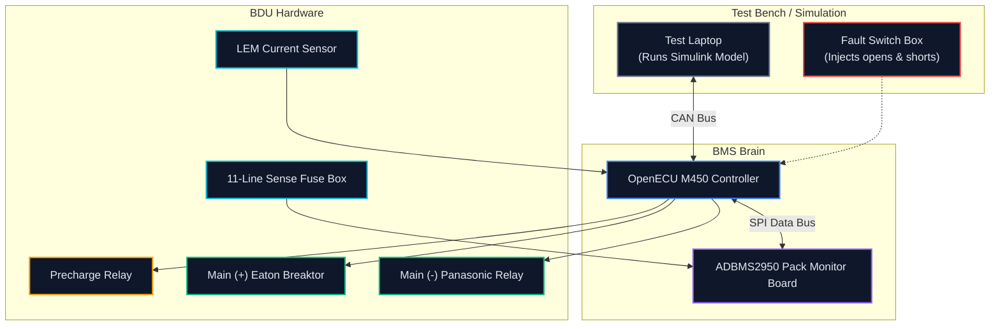
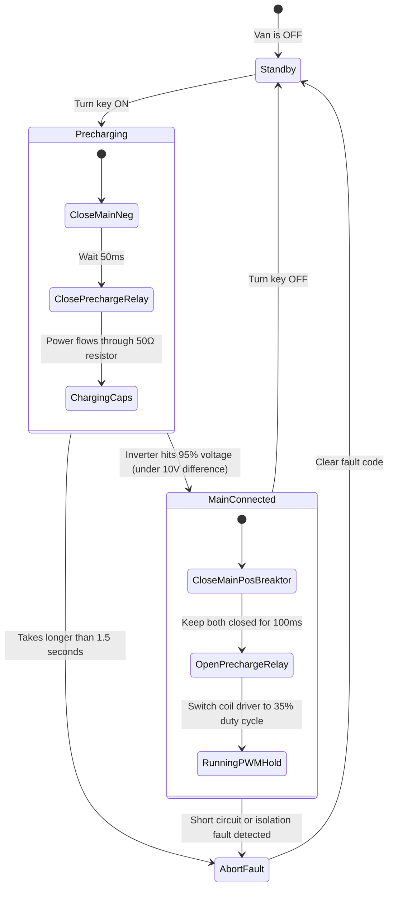

[← Back to Main README](../README.md) · [Previous: Testing & Diagnostics](../02-Testing-Validation-and-Diagnostics/)

---

# Controls, Board Repairs, and Year 3 Plans

This chapter covers the electronics and software side of the BDU: how our BMS controls the high-voltage switches, why precharge keeps our parts from blowing up, how we fixed a shorted board with hot air, and what we are doing in Year 3 to get the van moving.

> **Role & Timeline**:
> - **Phase 1: Prototyping** *(Jan 2025 – Apr 2025 · Hybrid · Electrical & Mechanical Team Member)*: Designed the 11-line fuse box in KiCad and SolidWorks to protect our cell voltage sense lines.
> - **Phase 2: Build & Track Testing** *(Apr 2025 – Aug 2025 · Remote · BDU Lead)*: Set up our precharge state machine, fixed a shorted surface-mount chip on our pack monitor, and tested fault triggers on the bench.
> - **Phase 3: Year 3 Integration & Redesign** *(Jan 2026 – Apr 2026 · Hybrid · BDU Lead)*: Led the full BDU redesign in SolidWorks, integrated our 1.1 kWh battery submodules, and wired the harness to move the van.

---

## Table of Contents

- [The Control Setup](#the-control-setup)
- [Why We Need Precharge (And How the Timing Works)](#why-we-need-precharge-and-how-the-timing-works)
- [Fixing a Shorted Surface-Mount Chip with Hot Air](#fixing-a-shorted-surface-mount-chip-with-hot-air)
- [Building the 11-Line Sense Fuse Box](#building-the-11-line-sense-fuse-box)
- [Test Bench Fault Tests](#test-bench-fault-tests)
- [Year 3 Goal: "Move the Van"](#year-3-goal-move-the-van)

---

## The Control Setup

To control the high-voltage contactors and talk to the rest of the van, we used an automotive-grade **OpenECU M450** running as our Battery Management System (BMS):



---

## Why We Need Precharge (And How the Timing Works)

Here is the problem: our motor inverter has huge empty capacitors (1000 µF) sitting across its input terminals. 

If you just slam the main 400V contactor shut onto an empty inverter, you create a momentary dead short. Thousands of amps rush in over a few microseconds:

```text
I_inrush ≈ 400V / 0.05Ω = 8,000 Amps
```

That giant arc will weld the contactor pads shut or blow our main fuses right away. To stop that, we use a precharge circuit:



### The Step-by-Step Sequence:
1. **Negative First**: The main negative contactor closes first to give the system a ground reference.
2. **Current Limiting**: The precharge relay closes. Current flows through our aluminum-housed 50Ω 100W resistor, capping peak current to just 8 Amps (400V / 50Ω).
3. **Checking the Voltage**: The BMS watches the inverter voltage. Once the difference between the battery and the inverter is under 10V (or inverter hits 95% of battery voltage), we close the main positive switch.
4. **Smooth Handover**: We leave both the main switch and the precharge relay closed together for 100 ms so the voltage doesn't dip, and then open the precharge relay.
5. **Safety Timeout**: If the inverter fails to charge up within 1.5 seconds, the BMS assumes there is a short in the inverter, opens all switches immediately, and locks out the system.

---

## Fixing a Shorted Surface-Mount Chip with Hot Air

During our first bench tests, our BMS controller couldn't talk to the **ADBMS2950** pack monitor board. We kept getting communication errors over the SPI bus:

```text
[00:01.200] [ERROR] [SPI] Checksum mismatch. Expected 0x00, got 0xFA.
[00:01.210] [ERROR] [SPI] Pack monitor chip not answering.
[00:01.220] [FAULT] [SYS] High Voltage Interlock tripped -> Shutting down.
```

### How We Tracked It Down:
1. We hooked an oscilloscope up to the differential signal lines (IPA and IMA). The waveforms looked completely distorted, pulled down toward ground.
2. We inspected the board under a microscope and found the problem: a tiny digital isolation chip in a QFN package had solder bridged underneath its pins, shorting the signal line to digital ground.

### How We Fixed It:
- We set up our hot-air rework station with flux and heated the chip until the solder flowed, then pulled the chip off with tweezers.
- We used copper solder wick to clean up the excess solder on the PCB pads until they were flat.
- We put down fresh lead-free solder paste, aligned a new replacement isolation chip, and reflowed it with hot air.
- Once it cooled, we plugged it back into the scope. The signals were crisp, and we logged over 10,000 data packets without a single dropped byte.

---

## Building the 11-Line Sense Fuse Box

Every battery pack has thin sense wires running to the cells so the BMS can monitor individual voltages. If one of those thin wires gets pinched or shorts out against the metal frame, you have the full energy of the battery pack behind it, which can start a fire.

To protect the pack, we built a dedicated **11-Line Sense Fuse Box**:

```text
11 Cell Sense Wires from Battery
              │
     [ Molex Connector ]
              │
     [ 11x 500mA Fast Ceramic Fuses ]  <-- Blows quickly if a sense wire shorts
              │
     [ Custom Perfboard ]
              │
     [ 3D-Printed Flame-Retardant Box ]  <-- 5mm walls with 5mm raised legs
              │
     To BMS Voltage Inputs
```

- **Fuses**: We used **500mA fast-acting ceramic fuses** (Littelfuse 0154.500). Normal voltage sensing only draws tiny micro-amps, so 500mA is plenty for normal operation, but blows instantly during a short.
- **The Box**: We modeled the small box in SolidWorks with 5 mm thick walls and 5 mm legs to raise it off the mounting plate. That way, if a fuse ever blows, any carbon soot stays trapped in the box and cannot track across metal.

---

## Test Bench Fault Tests

At the Indianapolis competition, winning teams like McMaster and Ohio State stood out because they could intentionally trigger electrical faults on their test bench to prove their safety software worked. 

We brought our setup up to the same standard by testing these four fault scenarios:

| Test Case | What Fault We Injected | What the System Did | Result |
| :--- | :--- | :--- | :--- |
| **TC-01** | Fast-charge contactor heating up (T > 65°C) | Cut charger current from 300A down to 150A. If temp hit 75°C, shut off. | **PASS** (Charger stepped down smoothly) |
| **TC-02** | Welded main contactor | Commanded contactor open, but checked if voltage stayed high across contacts. | **PASS** (Detected welded switch in 15 ms; locked out precharge) |
| **TC-03** | Short circuit in motor inverter | Inverter voltage failed to climb past 50V during precharge. | **PASS** (Opened precharge relay at 1.5s; 50Ω resistor stayed cool) |
| **TC-04** | High-voltage leak to chassis | Added a 100 kΩ leak path from 400V to van frame. | **PASS** (ADBMS2950 detected isolation drop and flagged safety alarm) |

---

## Year 3 Goal: "Move the Van"

In early 2026, I returned as **BDU Lead (Jan 2026 – Apr 2026)** to get our hardware into the actual Ram ProMaster and get it driving on the track:

1. **The SolidWorks Redesign (February 2026)**:
   - Built the new angled lid enclosure shown in our CAD renders so we could service the box easily inside the van.
   - Built the 20 kHz PWM coil holding circuit right into our circuit board so we never have to worry about hot relay coils again.
   - Fixed the bimetallic joint issue by making custom copper neck pieces that slide cleanly through our LEM current sensor.
2. **Hooking Up the Battery Submodules**:
   - Mounting the real 63-cell NMC battery modules (1.1 kWh each, 10.9V nominal, 105 Ah) into the lower tray.
   - Adding fiberglass protective shields to pass SAE drop and puncture safety checks.
3. **Van Wiring & Track Commissioning**:
   - Wiring our low-voltage harness into the van's main computer over CAN bus.
   - Running low-speed tests on the dynamometer before taking the van out onto the track.

---

[← Back to Main README](../README.md) · [Previous: Testing & Diagnostics](../02-Testing-Validation-and-Diagnostics/)
