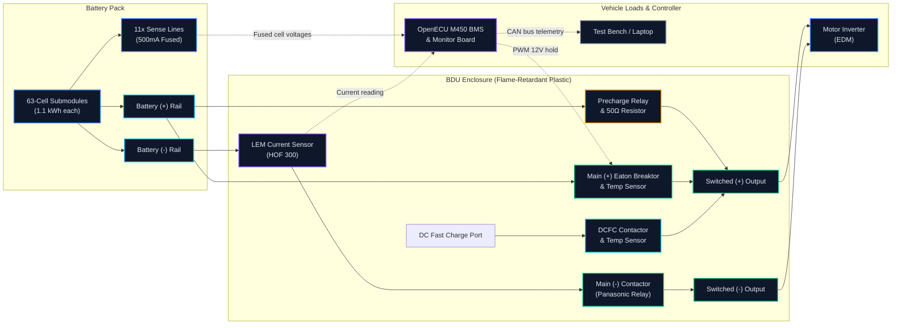
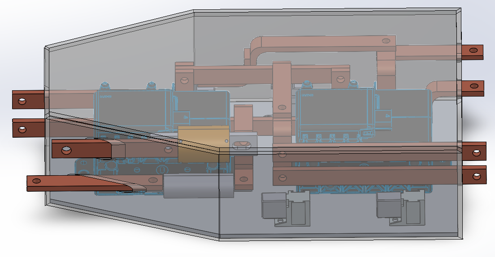
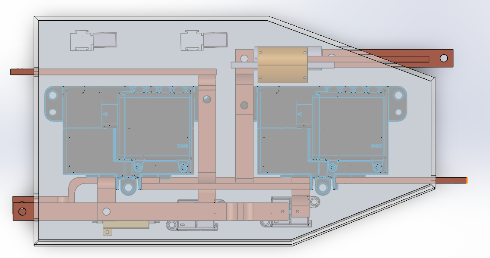
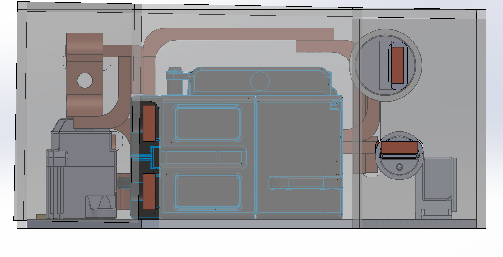
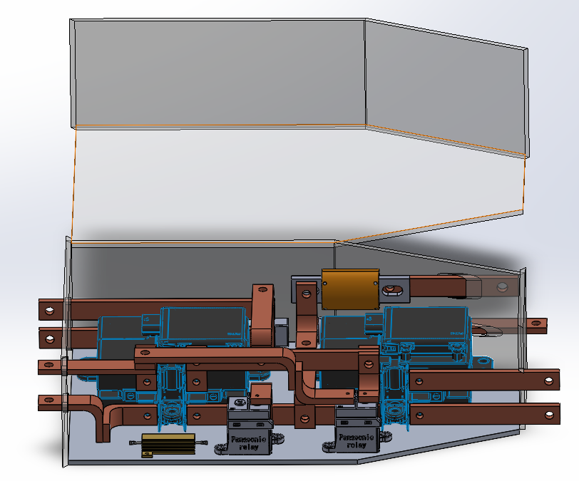

<div align="center">

# High-Voltage Battery Disconnect Unit (BDU)
### Packaging, busbars, thermal testing, and troubleshooting for our Ram ProMaster electric van.

[](.)
[](.)
[](.)
[](.)
[](.)
[](.)
[](.)
[](.)

</div>

---

## What This Project Is About

I worked on the Battery Disconnect Unit (BDU) for our Ram ProMaster electric van in the **Battery Workforce Challenge (BWC)**. We were a joint team from the **University of Waterloo and Lambton College**.

The BDU is basically the main power switchboard and safety box for the high-voltage battery. It sits right between our lithium-ion battery modules and the rest of the van (the motor inverter and the DC fast-charging port). When you turn the van on, it connects high voltage safely through a precharge resistor. If there's an electrical fault or a crash, it has to cut off hundreds of amps in just a few milliseconds so nobody gets hurt.

Here was the main headache: the space inside the battery tray was tiny. We only had 100 mm of height to fit two huge Eaton Breaktors, Panasonic contactors, a precharge resistor, a current sensor, and thick busbars. None of the live conductors could touch, and they all had to stay cool under high current.

I worked on this across two competition years. In Year 2, I started by modeling parts and prototyping in SolidWorks. Then I took over as BDU Lead to build the physical box, wire it, and test it at our May 2025 competition in Indianapolis. In Year 3 (early 2026), I came back as BDU Lead to redesign the whole box from scratch so we could fix the issues we found at the track and get the van driving.

> **Sanitization Note**: All Stellantis CAD files, private passwords, and confidential competition numbers were removed or replaced with generic models and open test numbers. Everything technical here is real work that was built and verified on real hardware.

---

## My Timeline & Roles

Here is how the work broke down across the two years:

```mermaid
timeline
    title How the BDU Project Progressed
    section Year 2: Prototyping (Jan 2025 - Apr 2025)<br/>Electrical & Mechanical Team Member
        Jan 2025 : Checked tray space constraints : Picked Eaton Breaktors and relays
        Feb 2025 : 3D CAD modeling in SolidWorks : Sized 1" x 1/4" aluminum busbars
        Mar 2025 : Checked high-voltage safety gaps (SAE F-3.5) : Made wood and plastic bench mockups
        Apr 2025 : Built first prototype box : Sent parts to Lambton team
    section Year 2: Build & Competition (Apr 2025 - Aug 2025)<br/>BDU Lead | Team Choice
        Apr 2025 : Stepped up as BDU Lead : Ran assembly and quality checks
        May 2025 : Competed in Indianapolis : Passed 300A 30-minute fast-charging test
        Jun 2025 : Tracked down post-competition bugs : Looked into hot 12V relay coils
        Jul 2025 : Built a 20 kHz PWM holding circuit : Fixed broken monitor chip on test bench
        Aug 2025 : Wrote up Year 2 competition report : Set up handoff notes
    section Co-op Break (May 2025 - Dec 2025)<br/>Reliability Engineering Intern at OtO Inc.
        May 2025 - Dec 2025 : Hardware reliability testing : Wrote Python and SQL data scripts
    section Year 3: Complete Redesign (Jan 2026 - Apr 2026)<br/>BDU Lead | Team Choice
        Jan 2026 : Returned as BDU Lead : Planned the "Move the Van" push
        Feb 2026 : Rebuilt the whole CAD model in SolidWorks : Made the angled service cover
        Mar 2026 : Fixed copper-to-aluminum joints : Made narrow copper piece for current sensor
        Apr 2026 : Wired up 1.1 kWh battery submodules : Got ready for vehicle track testing
```

| Phase & Role | Dates & Setup | What I Actually Did |
| :--- | :--- | :--- |
| **Phase 1: Electrical & Mechanical Team Member** | **Jan 2025 – Apr 2025**<br/>*(4 mos · Hybrid)* | • Modeled the initial BDU in **SolidWorks**.<br/>• Figured out how to fit everything inside the 100 × 610 × 175 mm tray pocket.<br/>• Sized the main busbars using 1" × 1/4" aluminum bar stock.<br/>• Kept high voltage at least 30 mm away from low voltage wires to pass safety rules.<br/>• Built a small fuse box to protect the 11 cell-voltage sense lines. |
| **Phase 2: BDU Lead \| Team Choice** | **Apr 2025 – Aug 2025**<br/>*(5 mos · Remote / Indianapolis)* | • Ran the build and assembly of the real hardware.<br/>• Torqued every bolt, checked wire crimps, and brought the BDU to **Indianapolis in May 2025**.<br/>• Ran the 300A DC fast-charging test for 30 minutes straight (temperatures stayed well below our 30°C limit).<br/>• Looked into a yellow flag from the judges about a 12V relay coil running hot, and fixed it with a PWM circuit. |
| **Phase 3: BDU Lead \| Team Choice** | **Jan 2026 – Apr 2026**<br/>*(4 mos · Hybrid)* | • **Redesigned the whole BDU in SolidWorks** (the February 2026 CAD models shown in this repo).<br/>• Added an angled top lid so we could inspect contacts without pulling the box out of the van.<br/>• Fixed galvanic corrosion issues between copper lugs and aluminum bars.<br/>• Made a custom copper neck piece to fit through the narrow hole in our LEM current sensor.<br/>• Hooked up our real 1.1 kWh NMC battery submodules so the team could move the van under its own power. |

---

## Quick Numbers

- **300A DC Fast Charging** ran for **30 minutes straight** with less than a **30°C temperature rise**.
- **100 × 610 × 175 mm** box size to fit inside the tight battery tray pocket.
- **390A peak / 260A continuous** current through custom 1" × 1/4" aluminum busbars.
- **Over 30 mm gap** between high-voltage busbars and low-voltage signal wires.
- **65% less heat in our contactor coils** after building a simple 20 kHz PWM holding circuit.
- **11 cell sense lines** protected with individual 500mA fuses.
- **100% pass rate** on all safety and electrical inspections at the Indianapolis competition.

---

## Flagship Case Study

> 🔍 **Case Study: Why our 12V contactor coil hit 50°C during fast charging, and how a PWM holding circuit fixed it**  
> During our 300A fast-charging tests, the heavy busbars stayed cool, but our low-voltage 12V contactor coil climbed up to 48.5°C inside the sealed box. We dug into why, figured out the magnetic air gap physics, and built a simple two-stage PWM driver that dropped the heat by 87%.  
> [Read the step-by-step breakdown here](02-Testing-Validation-and-Diagnostics/Contactor-Holding-Current-Investigation.md).

---

## System Flowchart

Here is how power, safety switches, and sensors connect together inside the BDU:



---

## 3D CAD Renders

These are the SolidWorks CAD views from our Year 3 redesign (February 2026):

| Isometric View | Top-Down Busbar View |
| :---: | :---: |
|  |  |
| *Eaton Breaktors, stepped busbars, and LEM Hall sensor packaged inside the plastic housing.* | *Making sure high-voltage bars clear low-voltage wires and fuse blocks.* |

| Side Pass-Through View | Exploded Lid View |
| :---: | :---: |
|  |  |
| *Circular ports where busbars enter and exit with orange insulation sleeves.* | *Angled lid lifted to show the precharge resistor, small relays, and main switches.* |

---

## Folder Guide

```text
BDU-Showcase/
├── README.md                                           <-- You are here
├── assets/                                             <-- CAD renders and photos
├── 01-Electromechanical-Architecture/
│   └── README.md                                       <-- Packaging, busbars, safety spacing, bolts, and gotchas
├── 02-Testing-Validation-and-Diagnostics/
│   ├── README.md                                       <-- Indianapolis competition testing & thermal numbers
│   └── Contactor-Holding-Current-Investigation.md      <-- Flagship Case Study: 12V coil overheating post-mortem
└── 03-HIL-Bench-and-Pack-Integration/
    └── README.md                                       <-- BMS controls, precharge timing, board repair, Year 3 plan
```

| Chapter | What It Covers | Key Topics |
| :--- | :--- | :--- |
| [**01. Electromechanical Architecture**](01-Electromechanical-Architecture/) | Physical packaging & busbar design | 1" × 1/4" aluminum busbars, 30 mm safety clearance, torque marks, avoiding bolt bottom-outs, and mixing copper with aluminum. |
| [**02. Testing & Competition Diagnostics**](02-Testing-Validation-and-Diagnostics/) | Real-world testing at competition | 300A fast-charging test run in Indianapolis, where we placed temperature sensors, and the **Flagship Case Study**. |
| [**03. HIL Bench & Pack Integration**](03-HIL-Bench-and-Pack-Integration/) | Controls, board repairs, and Year 3 | OpenECU BMS setup, precharge timing, fixing a shorted surface-mount chip with hot air, and our Year 3 plan to move the van. |

---

## Operating Specs

| Item | Value | Why It Matters |
| :--- | :--- | :--- |
| **Vehicle** | Ram ProMaster Commercial Van | The electric van we were building the pack for. |
| **Competition** | Battery Workforce Challenge (DOE / Stellantis) | Multi-year engineering competition for North American universities. |
| **Pack Voltage** | 350V – 400V DC | Runs the electric motor and fast charging. |
| **Current Limits** | 390A Peak / 260A Continuous | Handles hard acceleration and 150 kW DC fast charging. |
| **DC Fast Charging Target** | 300A for 30 minutes straight | Tested in Indianapolis without needing any liquid cooling inside the BDU box. |
| **Safety Gap** | At least 30 mm (HV to LV) | Keeps 400V from jumping onto 12V signal wires (SAE rule). |
| **Plastic Rating** | UL94 V-0 flame-retardant | If a spark happens, the plastic self-extinguishes in under 10 seconds. |
| **Temperature Rise Limit** | Under 30°C rise over ambient | Protects contactors and wire insulation from cooking over time. |

---

## Suggested Reading Order

1. **Check out [Chapter 1 (Packaging & Busbars)](01-Electromechanical-Architecture/)**: See how we shaped the busbars, squeezed everything into 100 mm of height, and avoided stupid assembly mistakes.
2. **Read [Chapter 2 (Testing & The Case Study)](02-Testing-Validation-and-Diagnostics/)**: See how the box did under 300A fast charging, and read our deep dive on fixing the hot relay coil.
3. **Look at [Chapter 3 (Controls & Year 3 Plan)](03-HIL-Bench-and-Pack-Integration/)**: See the precharge timing logic, how we fixed a shorted board with hot air, and how we're finishing the van build.

---

<div align="center">

**Christopher Koo**  
**Battery Disconnect Unit Lead | Team Choice** *(Jan 2026 – Apr 2026 · Hybrid)* — *Year 3 BDU Redesign*  
**Battery Disconnect Unit Lead | Team Choice** *(Apr 2025 – Aug 2025 · Remote)* — *Year 2 Build & Indianapolis '25*  
**Electrical and Mechanical Team Member** *(Jan 2025 – Apr 2025 · Hybrid)* — *Year 2 Prototyping & CAD*  
*Mechatronics / Systems Engineering · University of Waterloo*  
*Battery Workforce Challenge (UW & Lambton College EV Powertrain Team)*

</div>
